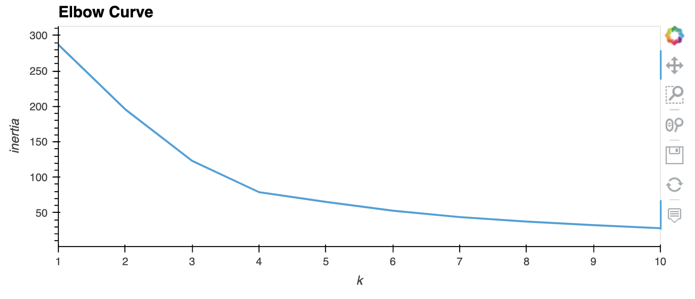
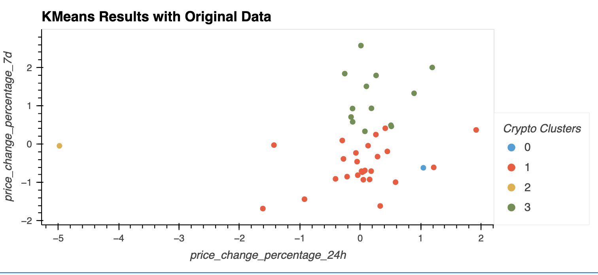
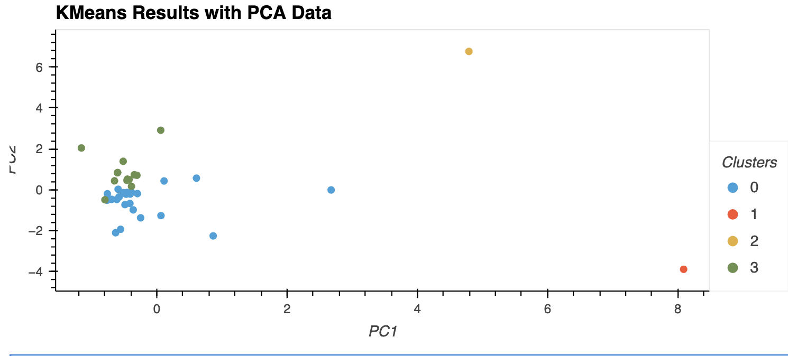

# Model Crypto Investments
In this project, price change data on cryptocurrency coins is analyzed using KMeans modeling. It is then compared to the same data transformed by PCA and rerun with the KMeans model to compare the resulting dats. The original data is scalled, modeled and visualized, then PCA is applied to the data to transform it from 7 features to 3 before the KMeans model is applied to the new dataframe. The the results of each process are visualized and compared.

The CSV file, `crypto_market_data.csv` is provided in the Resources folder; it contains price change data of cryptocurrencies in different periods.

The steps for this comparison are broken into the following sections:

1. Import and Preprae the Data 
2. Find the Best Value for k 
3. Cluster Cryptocurrencies with KMeans modeling
4. Optimize Clusters with Principal Component Analysis
5. Recalculate k and use KMeans model using PCA data
6. Visualization and comparison of Original Data to PCA Data


## Technologies
This project leverages python 3.7.13 with the following packages:

pandas - For data analysis

hvplot - for data visualizaion

sklearn - for modeling libraries

## Import and Prepare the Data
1. Data is imported from crypto_market_data.csv file located in Resources folder, and transformed to a dataframe using pandas.  
2. The dataframe is diplayed and plotted before using the StandardScaler module from scikit-learn to normalize the file data making it easier to compare and graph.

## Finding best value for k
1. Code is written to use the elbow method algorithm to find the best value for k.
2. Inertia is calculated for each possible k using the KMeans model and scaled dataframe. 
3. A line chart with all the inertia values computed for the different values of k isused to identify the optimal value for k.

`df_elbow1.hvplot.line(x='k', y='inertia', title='Elbow Curve', xticks=k)`



## Cluster Cryptocurrencies using KMeans modeling
1. Optimal k for the dataframe computed above is used to cluster the data, and fit it to the scaled dataframe
2. A new dataframe "df_market_preditcions' is made with the coins associated with a cluster value
3. Scatter plot shows the distribution of the clusters around the 24hour percent price change and the 7day percent price change

## Optimizing Clusters with Principal Component Analysis (PCA)
1. Create a model instance decreasing the components to 3.
2. Run the PCA model then view the new dataframe with 3 principal components

```# Create a PCA model instance 
pca = PCA(n_components=3)
# Use the PCA model with `fit_transform` to reduce to 
# three principal components.
market_pca_data = pca.fit_transform(df_market_data_scaled)
# View the first five rows of the DataFrame. 
market_pca_data[0:5]
```

3. Check how much variance is associated with each component to see how much of your original data informaiton is being caputred by each component.
4. Calculatee the total explainded variance by adding the variance of each of the 3 components.

`pca.explained_variance_ratio_`

## Recalculate k and use KMeans model using PCA data
1. Using the new 3 coponent PCA data for each coin, apply the elbow method as noted above, then run the KMeans model again using the resulting value of k.
2. Plot the resulting dataframe in a scatterplot

## Visualization and comparison of Original Data to PCA Data


It appears the results of the original scaled data, when compared by features, is similar to the PCA Data in recommended clusters and layout.  PCA data does exclude some of the noise of the 7-features in the original dataframe. Visually this can be seen in more concentrated data points around the cluster centers.


